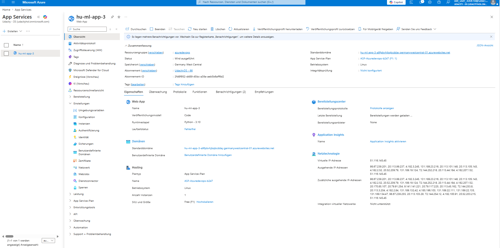
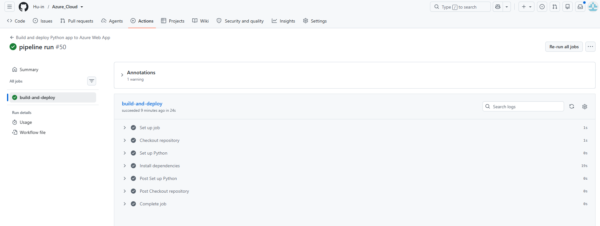

# Azure_Cloud

# Project Management

## Trello Board

This project uses a Trello board to manage tasks and track progress across development stages.

You can view the project board here:
https://trello.com/b/TJLqBZZc

Project plan is available in Project-management.xlsx

---
## Azure ML Flask App Deployment

## Overview
This project demonstrates deployment of a Flask Machine Learning application
using Docker, Kubernetes, and Azure App Service.

The application predicts housing prices using a trained ML model.

---
# Architecture Diagram

The following diagram shows the overall system workflow:

---
## Project Structure

- `app.py` → Flask application
- `model_data/` → Trained ML model
- `Dockerfile` → Container definition
- `run_docker.sh` → Run locally in Docker
- `run_kubernetes.sh` → Deploy to Kubernetes
- `make_predict_azure_app.sh` → Test deployed Azure endpoint

---
## Screenshots

### Azure Prediction Output

### Local Test

### Azure Deployment

### GitHub Actions

---

##  Demo Video

Watch the demo video here:

https://youtu.be/Hc-TY1haU9Y

---
## Updated Project Demo Video
I have added an additional screencast to clearly demonstrate the Continuous Integration and Continuous Delivery workflow. The video shows a code change, GitHub Actions pipeline execution, and the automatic deployment reflected in the live Azure application.

You can watch the updated demo video here:

https://youtu.be/tuvXapp19vE

---
## Azure App Service Deployment

The following screenshot shows the deployed Azure Web App:

---
## CI/CD Pipeline Execution

The following screenshot shows a successful CI/CD pipeline execution (build and deployment):

---

##  Setup Instructions

1. Clone the repository
git clone <your-repo-url>
cd Azure_Cloud

2. Install dependencies
pip install --user -r requirements.txt

3. Run the application locally

python app.py

4. Open in browser
http://127.0.0.1:8000

5. Test prediction locally
./make_predict_azure_app.sh

6. Deployment (CI/CD)
Push code:
git push

---
## Azure CLI Commands

The Azure resources for this project can be created and managed using the Bash script:

commands.sh

This script includes all required Azure CLI commands such as:
- Creating a resource group
- Creating an App Service plan
- Deploying the web app
- Configuring GitHub deployment

---
# Future Enhancements

The project can be improved in several ways:

Add more advanced ML models (e.g., neural networks)
Implement input validation and error handling
Add unit and integration testing
Improve UI with a frontend (React/HTML)
Use Docker for containerized deployment
Add monitoring with Azure Application Insights
