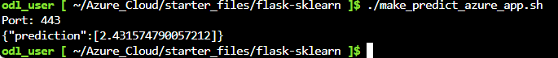
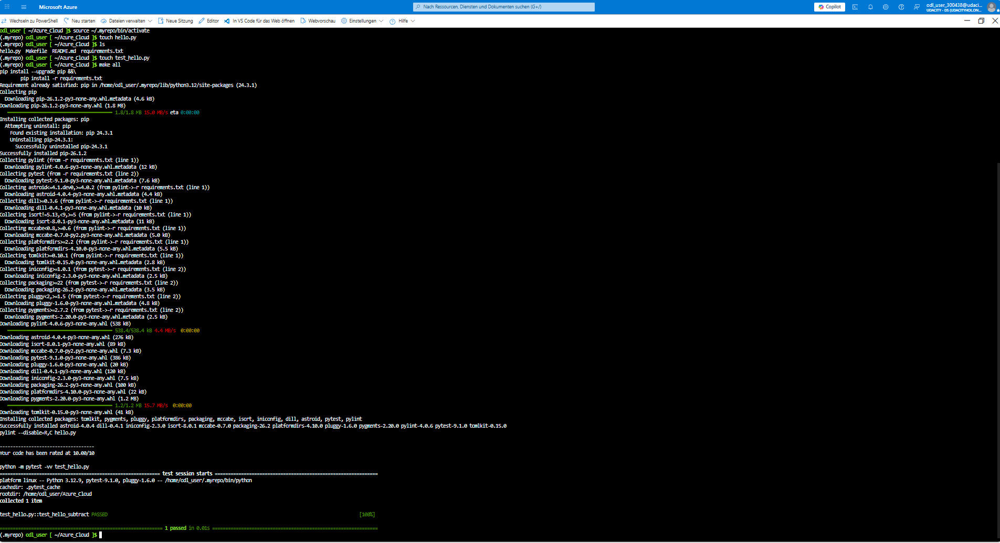
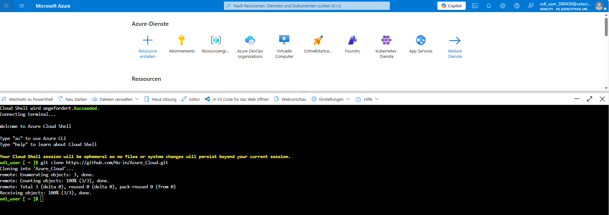
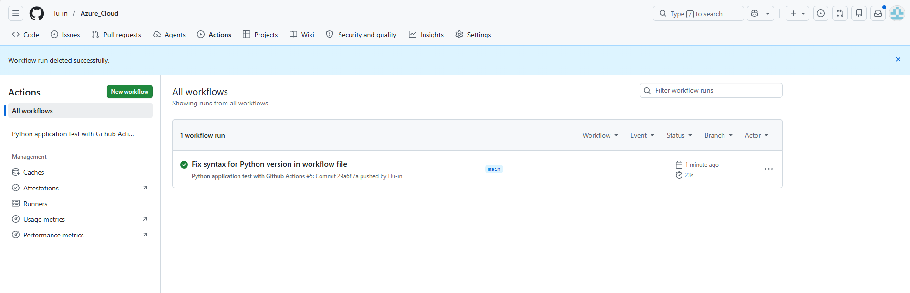

# Azure_Cloud
# Project plan is available in Project-management.xlsx
[](https://github.com/Hu-in/Azure_Cloud/actions/workflows/pythonapp.yml)
# Azure ML Flask App Deployment

## Overview
This project demonstrates deployment of a Flask Machine Learning application
using Docker, Kubernetes, and Azure App Service.

The application predicts housing prices using a trained ML model.

---

## Project Structure

- `app.py` → Flask application
- `model_data/` → Trained ML model
- `Dockerfile` → Container definition
- `run_docker.sh` → Run locally in Docker
- `run_kubernetes.sh` → Deploy to Kubernetes
- `make_predict_azure_app.sh` → Test deployed Azure endpoint

---
## Screenshots

### Azure Prediction Output



### Local Test



### Azure Deployment



### GitHub Actions



---
##  Setup Instructions

### 1. Clone repository
```bash
git clone <your-repo-url>
cd flask-sklearn
``
